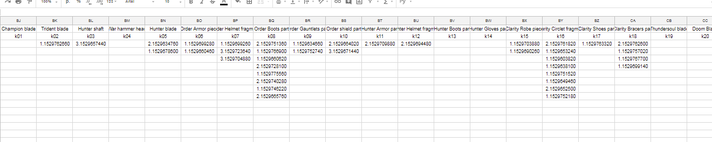
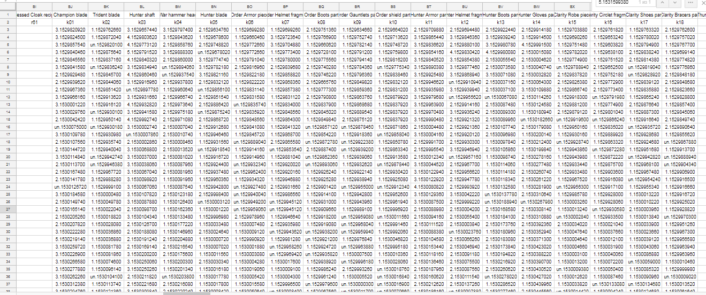
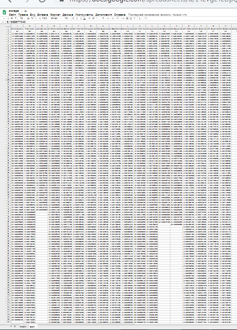
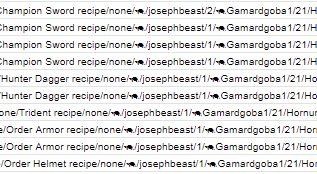

#### CW-Notify-Storage

## Change Log

`26.12.2020` - Добавил print() в `additional/game_objects.py` (Нужно для дальнейшего апдейта). Планирую перейти на 
парсинг по новой ссылке `https://t.me/s/`. Отредактировал README.md, было много орфографических и пунктуационных ошибок.
С этого числа стартует Change Log, летопись теперь внизу.

###### Летопись игровых событий и разработки (за период с сентября 2018 по ноябрь 2020)
`Сентябрь 2018 года` [Auction Notify](https://github.com/evolvestin/CW-Auction-Notify) Оказался крайне популярен.
Идея, которая отражена в названии была простой и очень полезной, отправлять сообщения о новых лотах их подписчикам.
Естественно, подписаться можно было на конкретные типы лотов, а не на все сразу, что резко убило популярность каналов с лотами
[ChatWars3](https://t.me/chatwars3), [ChatWarsAuction](https://t.me/ChatWarsAuction), [CW3Auction](https://t.me/CW3Auction).

Тогда я решил, что можно начать расширять функционал бота, а тем самым увеличивать его популярность. Мне попался на глаза канал,
сейчас уже не вспомню ссылку, может он уже не существует. Суть была в том, чтобы вести статистику по предметам на бирже в игре.
И я подумал, а почему бы не реализовать нечто подобное, только для предметов с аукциона.

1. Нужно было спарсить уже имеющиеся лоты в игре. А биржа на ChatWars 3 появилась в мае и там уже было 40 тысяч лотов.
2. Эти лоты нужно было постоянно обрабатывать, потому что каждый день добавлялись все новые и новые.
3. К тому времени уже существовала версия бота для европейской версии игры и я подумал, что стоит сделать статистику и для
их сервера в боте.

Ну и тут сказалась моя неопытность. Тогда версии ботов имели отличия и приходилось очень много чего доделывать на ходу, чтобы
одно и то же работало и там, и тут. Я решил переписать все так, чтобы один и тот же код работал на обоих ботах, а все различия 
(вроде токенов, айдишников и текстов, были вынесены в отдельный файл). И это заняло еще довольно много времени.

`Октябрь 2018 года` Я закончил сводить код [Auction Notify](https://github.com/evolvestin/CW-Auction-Notify) и вернулся к
созданию статистики для игровых аукционов.

И допустил еще одну (даже несколько) ошибок. Я решил, что парсить я буду все лоты, но мне не нужна вся информация о лотах.
Мне было достаточно узнать название предмета, понять какой у него айди в игре и записать его цену и время окончания лота.

Все это я решил записывать в гугл таблицы, где каждый столбец отвечал бы за свой предмет, а строки бы заполнялись в каждом столбце
отдельно, обозначая цену и время окончания. Выглядело это так:

Только вот я не учел, что в какой-то момент предметов в игре станет несколько больше, количество столбцов в гугл таблицах
ограничено. Тогда пришлось городить вторую таблицу, с предметами, но и её могло в будущем не хватить. Еще одной проблемой стала
скорость записи в эти таблицы и объем документа в гугле. Он стал настолько большим, что в какой-то момент перестал открываться.
Вот шакальный скриншот небольшого участка таблицы, ну так, для понимания масштабов проблемы.

---
#### Где-то здесь стартует начало комитов в этот репозиторий
`15.12.2018` - Начало больших изменений в боте. При этом старая версия продолжает работу, я сел переписывать, но путь был
долгим.

Для начала я решил парсить лоты по-новому, все еще используя для этого паттерны, но сохраняя при этом гораздо больше 
информации о лоте. Сохранялось при этом (записывалось все это через слеш в одну ячейку и в один столбец):
   > Айди лота, название предмета, продавец, цена, покупатель, время его окончания, статус с которым он завершился и другие параметры.

Выглядело это так (других скриншотов не отыскал):

   > Как можно видеть, записывалось все в одной определенной последовательности и там где не было информации обозначалось none,
   > делалось это для того, чтобы я мог точно знать какой длины будет массив.

К моменту начала нового парсинга количество лотов на обоих серверах уже перевалило за 100к и он занимал что-то около двух суток,
тогда я не знал про существование асинхронных алгоритмов и парсил все последовательно методично пользуясь обычным requests.get().
Тогда мне что-то стало скучно и я забросил разработку на месяц.

`15.01.2019` - После насыщенного нового года, я вновь вернулся к разработке и сразу выяснилось несколько новых деталей.
В игре ввели качество и состояние у некоторых групп предметов и качество серьезно влияло на статистику 
(предметы с высоким качеством ценились сильно выше).

`20.01.2019` - Допарсили оба аукциона. Пришло время дописывать части, которые считают статистику. Собственно, за это
отвечает функция `messages()`, она была и раньше в боте, её я не меняя вставил сюда и запустил бота, отключив старого, который
уже к тому моменту перестал выдавать правильно статистику.

`24.01.2019` - Я решил добавить две проверки, которые бы парсили заново аукцион.

Функция `checker()` шла в обратном направлении (на уменьшение постов на аукционе) и проверяла существование записи, если нет
писала об этом мне в личные сообщения.

Функция `double_checker()` проверяла, нет ли повторяющихся записей в гугл таблице.
   > Была написана из рук вон плохо, проверка была крайне медленной.
   > Вся проблема была в том, что мой алгоритм записи в гугл таблицы был с дефектом, иногда он мог записать по два лота, что
   > случалось довольно часто.

Потом, мы от них избавились, но я уже не помню когда.

`Март 2019 года` - В игре выходит очередное обновление, которое у некоторых групп предметов отображает в лотах дополнительные
характеристики. Тогда мне было лень учитывать все эти параметры, я решил просто не учитывать их при подсчёте статистики.
Использовал для этого обычный `re.sub()`. Это обновление я игнорирую ещё очень долгое время.

`Апрель 2019 года` - Ещё одно обновление в игре и аукционе. Добавляют возможность видеть ник игрока который купил предмет.
Раньше после окончания лота был виден только замок из которого был игрок.

`Ноябрь 2019 года` - Добрался до исправления всех оплошностей в боте. Решил переписать почти всё, что меня раздражало, 
поправить статистику.

Принял волевое решение заново спарсить все лоты, опять. Теперь я никак не форматировал полученную информацию, записывал
прямо так, как возвращается текст из html. Исключение -- переносы строк заменял на слеши, для удобства просмотра в гугл таблицах.

Тогда на каждом сервере было уже по 400к лотов и старым алгоритмом парсера бы не удалось быстро записать всё в таблицу.
Я все еще пользовался не асинхронным `requests.get()`, но я значительно сэкономил время на запись лотов (раньше я делал это
сразу как получил результат). Теперь я парсил 1000 лотов, а потом пачкой их записывал. Всё равно процесс растянулся на несколько
суток, но я был доволен скоростью.

Надо отметить, что решение сохранять 'сырую' информацию и по сей день остается идеальным решением. Я больше никогда с тех пор 
не парсил лоты с начала аукциона.

Единственная функция, которая не претерпела изменений - `messages()`, она работала хорошо, хоть код её мне и не нравился.

`03.12.2019` - Я решаю перестать использовать гугл таблицы для активных лотов. А в то время, активными лотами и их отображением
для быстрого запуска главного бота [Auction Notify](https://github.com/evolvestin/CW-Auction-Notify) занимался как раз этот бот.
   > Потому что мой алгоритм, который я использовал для записи, оставлял желать лучшего.

Тогда я придумал, что буду использовать канал в Telegram ([lot_updater](https://t.me/lot_updater)) для того, чтобы обмениваться 
информацией между ботами. Этот бот изменял пост на канале, писал туда айдишники активных лотов, а уже основной, парсил их без
особых проблем.
   > Ну как без особых. Проблема выяснилась позже, когда стало понятно, что активных лотов в ChatWars 2 бывает так много, что
   > они просто не умещались в размеры постов.

Функцию так и назвал - `telegram()`.

`Декабрь 2019` - Впервые узнаю про переменные окружения. Оказалось, **крайне** полезная штука. Переменные, которые можно было
один раз прописать на сервере, давали возможность полностью сделать код идентичным полностью и не заменять переменные в файле.
В [Auction Notify](https://github.com/evolvestin/CW-Auction-Notify) в это же время был сделан этот апдейт.

`24.05.2020` - После длительного перерыва и сносной работы бота, пришло время крупно обновить его. Большая часть кода была
переписана, даже чисто для красоты. Появляются первые наработки для будущей библиотеки с выносом туда многих повторяющихся
от бота к боту функций.

`19.07.2020` - Параллельно с написанием апдейтов к [основному](https://github.com/evolvestin/CW-Auction-Notify) боту,
решаю вынести в отдельного бота функцию `oldest()`, ту самую, которая парсит каналы и записывает лоты в таблицу.
Делаю это для экономии оперативной памяти на сервере и количества запросов к Telegram. Как выяснилось тогда, можно в минуту
делать [t.me](https://t.me) только 300 запросов.

Функция `oldest()` удалена отсюда и отправляется в отдельный репозиторий - 
[CW-Notify-Storage-Oldest](https://github.com/evolvestin/CW-Notify-Storage-Oldest).

`26.07.2020` - Пришло время выпустить большой апдейт для основного бота и заодно проапгрейдить этот. Теперь функции, которые
задействованы в обоих ботах вынесены в отдельный файл `additional/game_objects`, а также функции, которые используются
повсеместно (в многих других моих ботах) вынесены в файл `additional/objects`, который потом стал библиотекой e-objects.

Унификация и изменение внутренней структуры бота. Теперь, мы стали пользоваться Google Drive API и синхронизировать сразу
базы данных, а не лоты отдельно в гугл таблицах. 

Файлы взаимодействующие с Google Drive API, постоянно обновляются в гугл документах:
`lots.db` в которой хранятся все закончившиеся лоты. 
`active.db` - Бот занимается обновлением всех активных лотов. 
`storage.json` - Файл, который постоянно генерируется в функции `messages()`, статистика по предметам в удобном json формате.

`messages()` - Впервые с `2018 года` переписана и дополнена. Оказалось в Python существует большое количество удобных 
математических функций, которые позволяют не городить некрасивый код, а просто воспользоваться ими, например `median()` и т.д.
Также добавлены новые позиции в статистику:
- Отмененные лоты -- собственно, подсчёт отмененных лотов.
- Переименованные предметы теперь учитываются в статистике.
   > Не помню когда, но в игре появилась возможность переименовывать некоторые группы предметов.
   > С этим возник ряд проблем, переименованный предмет мог быть воспринят неправильно ботом, я решил этот вопрос.
   > Но в статистике они до этого момента не учитывались.

Функция `detector()` удалена (не совсем, изменен принцип работы) отсюда и отправляется в отдельный репозиторий - 
[CW-Notify-Detector](https://github.com/evolvestin/CW-Notify-Detector).
   > Опять таки для экономии ресурсов этого и основного ботов (в нем так же она удалена). Теперь новые лоты появляются в специальных
   > сообщениях на канале [lot_updater](https://t.me/lot_updater) и эти боты, лишь получают сигнатуру об изменении определенного
   > поста на этом канале. В получаемой сигнатуре уже находится 'сырой' текст лота, который уже можно записывать в базу и производить
   > дальнейшие действия.

`16.08.2020` - С релизом библиотеки [e-objects](https://github.com/evolvestin/e-objects) этот бот был одним из первых, кого
я обновил на неё, ну потому что уже имелся файл `additional/objects` из которого, собственно, и выросла библиотека.
Файл был удален, по причине ненадобности.

Удалена `telegram()` - не знаю, я видимо забыл удалить её в июле, она была не нужна еще с того времени.

`10.11.2020` - Я решил обновлять безопасность всех моих ботов. Теперь все токены были пересозданы (если посмотреть 
по комитам, то они мелькали частенько прямо в коде). Пересозданы токены сервисных аккаунтов гугл, файлы с этими токенами 
теперь генерируются при запуске бота, а сами они находятся теперь в переменных окружения.
   > Функция environmental_files() в e-objects.

`12.11.2020` - Обновление библиотеки e-objects до версии 1.2.0 и сопутствующие изменения в боте.

`18.11.2020` - Попытка найти редкий и странный баг в e-objects в edit_dev_message(). 
   > UPD: Баг нашёлся, но пока не пофикшен.

`23.11.2020` - Написана вот эта стена текста выше. Обновления ожидаются, всегда есть что добавить или улучшить, но пока
то что есть -- работает безупречно. Опубликовал репозиторий, он с `26.11.2019` был зачем-то мной закрыт от публичности.